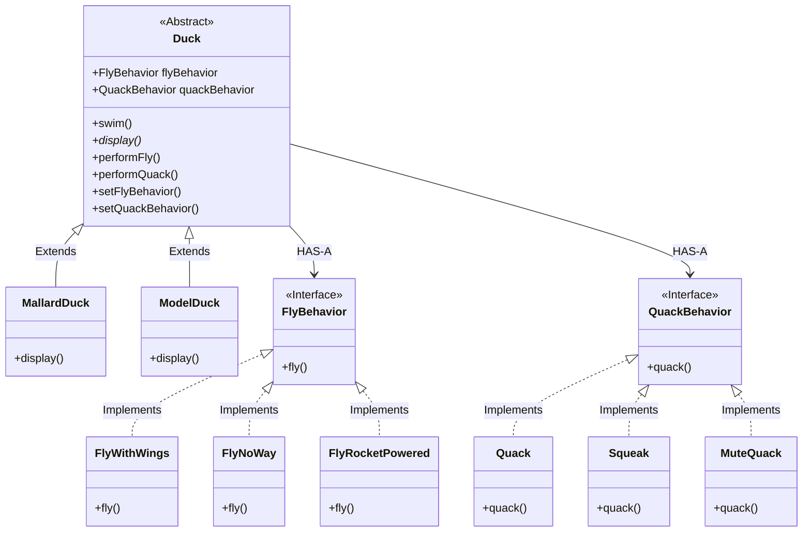

# Welcome to Design Pattern

> OVERVIEW: This chapter focuses on introducing the strategy pattern and key Object Oriented design principle

### The (made up) real-world problem presented in this chapter: 
- The SimUDuck game which has ducks that can quack has a new feature that about to be introduced into the game, which is flying ducks. The book highlight the approach: a parent class `Duck` that has method `fly()` and `quack()`.  <br>
  => The issue with this approach: Not every duck can both fly and quack, causing problem with maintenance and further expanding the code base.

- What about interfaces? `Flyable` and `Quackable` interfaces can help separate which duck can fly and which can quack. <br>
  => Still, overriding methods with 48 types of ducks introduces lots of code duplication. In other words, __NO__ code reuse. It solves the part of the problem and create another.

The problem at hand is, "whenever you need to modify a behavior, you're forced to track down and change it in all different subclasses in which the behaviour is defined"

### To combat this
The book urge us to identify which aspect of your application that vary ans separate them from what stays the same

Apart from `fly()` and `quack()`, the `Duck` class is working well and there're no other parts that change frequently. Therefore the logical step is to separate these parts.
- Leave the `Duck` class alone
- Create new sets of classes, one for `fly` and one for `quack`. Since these are completely isolated, we can create more if we want more behaviours in the future. For better alternating between behavior during run-time, let's create 2 interfaces the Behavior, `FlyBehavior` and `QuackBehavior`, along with specific classes to implement them (e.g., `FlyWithWings`, `FlyNoWay`, `Squeak`, `MuteQuack`).
- Make use of Composition: instead of `Duck` class handling the implementation, it holds the variables for `flyBehavior` and `quackBehavior`. It Delegate the implementation to the behaviour classes

```java
public class BigDuck {
  private FlyBehavior fb;
  private QuackBehavior qb;

  // other stuff

  public perfomQuack() {
    this.qb.quack();
  }

  public performFly() {
    this.fb.fly();
  }

  // other methods
}
```



This can be called interface programming. Interfaces as in the template for defining and interacting with objects, not the java's interfaces keyword (even though it can be similar, but not every language has an interface keyword) instead of programming implementation.

In this case, we see the `FlyBehavior` and `QuackBehavior` as interfaces both within technical boundary of the language and literal meaning.
### Benefits
- While we ARE setting behavior to concrete classes by instantiating objects of behaviour class like `Quack` or `FlyWithWings`, we can easily alter this at runtime using setters
  => INCREASE FLEXIBILITY

- HAS-A is better than IS-A or Composition is better Inheritance.


## The strategy pattern

What you just did is implement and apply the strategy pattern to your code;

> Definition: The strategy pattern is a behavioural design pattern that enables selecting an algorithm's behavior at runtime. Instead of implementing a single algorithm directly, code receives run-time instructions about which algorithm to use from a family of algorithm

- In this case, the "family of algorithms" in question are just the `quack`'s and `fly`'s that the duck may perform
- Since the quacks and flys can be assign, set and modified in during runtime, it helps alot with FLEXIBILITY

### Key components:

1. Interface:
- Declares a method that all concrete strategies must implement.
- In our example, they are `FlyBehavior` and `QuackBehavior`

2. Concrete strategies
- Implement different variations of the algorithm
- In our example, they are `FlyWithWings` or `Squeak`

3. Context
- Maintains a reference to a strategy object
- Can define an interface that lets the strategy access its data
