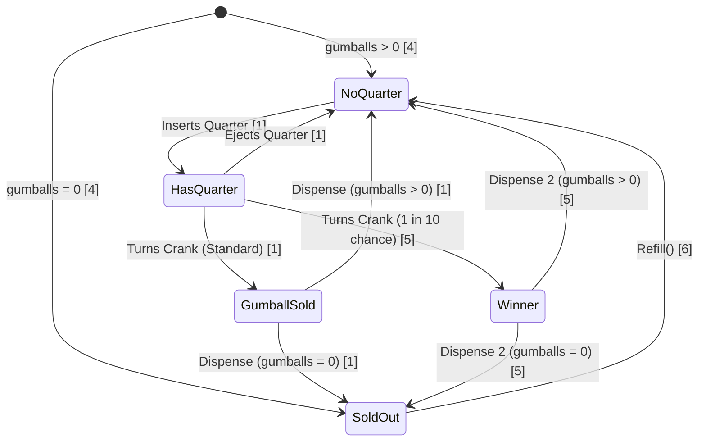

<!-- markdownlint-disable MD013-->

# The State Pattern

## The problem

Introduction to the gumball machine. The machine is expected to have a determined workflow:

It's quite clear-cut that the flow above is a state diagram and to implement this we'd use a state machine:

1. Gather up all possible states
2. Create instance variable to hold the current state, and define values for each states
3. Gather up all the actions that can happen in the system
4. Now we create a class that acts as the state machine. For each action, create a method that uses conditional statements to determine what behaviour is appropriate in each state.

This works. But of course, we receive a request for changes: Now the manufacturer wants to create a new mechanic: every 10 gumballs, the customer gets a free one. We have to extend our implementation.

The simplest implementation would be to have a global, shared state that indicate how many balls has been dispensed and if it reach 10x we perform the another action to dispense 2 balls.

The issue with this is pretty obvious: global state. And the fact that the logic is convoluted inside that 1, big state machine class, meaning that when 1 state changes we have to make changes to the whole state machine implementation.

## What to do?

Like in every other design pattern, We encapsulate what varies. In this case, the variable that need encapsulation is states

1. We'll define a state interface that contains method for every action in the gumball machine.
2. Implement the state class for every state of the machine
3. Finally, we're going to get rid of all of our conditional code and instead delegate to the state class to do the work for us.

With this we will

- Localize the behavior of each state into its own class
- Removed all troublesome if statements
- Closed each state for modification, making the whole machine open to extension by adding new state classes
- Created a code base and class structure that maps much more closely to the Gumball diagram

## The state pattern defined

> The state pattern allows an object to alter its behaviour when its internal state changes, the object will appear to change its class

Example implementation can be found in [./examples/statePattern.java](./examples/statePattern.java)
