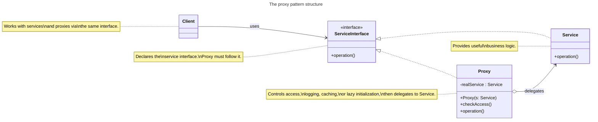

<!-- markdownlint-disable MD013-->

# The proxy pattern

## The problem

In the previous example, we've developed a solution to the gumball machines. Now the CEO wants the report of inventory and machine state. We satisfy him by quickly add extra variable called location to track which gumball machine is which

```java
public class GumballMachine {
  String location;
  public GumballMachine(String location, int count) {
    this.location = location
  }
}
```

Then we create another class called `GumballMonitor` which will allow use to track a gumball machine's location, inventory and current state. This seems clean until the boss demand a over-the-internet type of monitoring. Now we're already having a monitor class and don't exactly want to discard that, but the `GumballMachine` objects we need to monitor are 1 internet away so how do I track...?

The way to keep your monitor code the same is we employ a PROXY, who pretend to be the local `GumballMachine` machine object but in fact its talking to the real object over the internet.

> [!NOTE]
> (The book talks about specific in Java, which I will skip~)

## The proxy pattern defined

> The proxy pattern provides a surrogate or placeholder for another object to control access to it.

Structure:



Overall this is a pretty simple class diagram. Use cases of this pattern:

- Remote proxy controls access for a remote object
  - The proxy acts as a local representative for an object that lives in a different machine
- Virtual proxy controls access to a resource that is expensive to create.
  - The proxy creates the real subject when it's needed (lazy initialization)
  - The proxy may handle the request, or if the real subject has been created delegate the call to the subject
- Protection proxy controls access to a resource based on access rights
  - Something like a firewall, that authorize access before access to the real subject is granted.
  - Can also do rate limiting
- Caching proxy to cache request results to help improve performance
- Logging proxy can help keep a history of operation to of the subject
