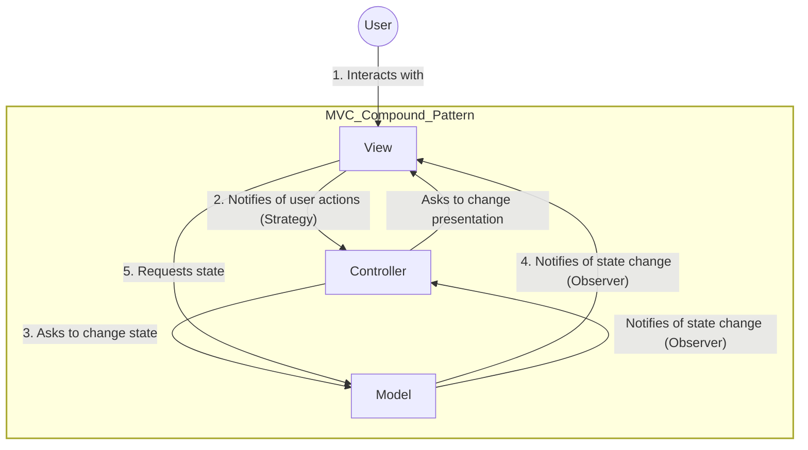

<!-- markdownlint-disable MD013-->

# The compound pattern

The best way to better use design patterns is to get them to interact together. We have a special name for a set of patterns that work together called compound pattern.

## The compound pattern defined

> The compound pattern as a set of two or more patterns that are combined into a design solution that solves a recurring or general problem

The idea of a compound pattern is not just having 2 pattern working in the same project calling themselves compound. The idea is that it must be a general-purpose solution applicable to many different problems.

## The king of compound pattern (MVC)

The prime example this book has for the compound pattern (which I can't find anywhere else) is MVC. The author made a point that while the MVC is usually mistaken for being a singular pattern, it's actually a set of pattern work together. As we all know, the MVC is a popular way of designing and implementing almost any applications. It stands for model-view-controller, and each of these represent a part of the system.

- MVC compound patterns Breakdown:
  - Observer: The Model uses this pattern to notify the View and Controller of state changes, keeping the Model independent of the other components.
  - Strategy: The View and Controller implement this pattern; the View is an object configured with a strategy, and the Controller provides that strategy by deciding how to handle user input.
  - Composite: The View uses this pattern internally to manage the hierarchy of GUI components like windows, panels, and buttons.
