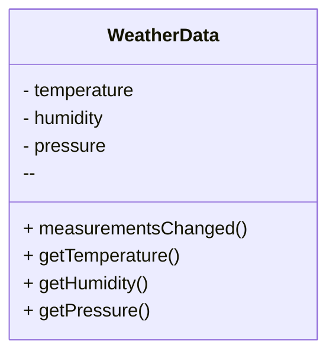
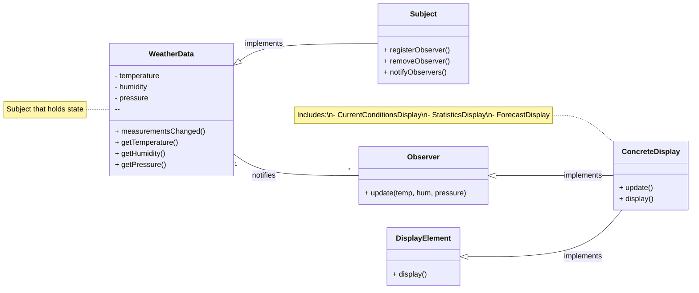

<!-- markdownlint-disable MD013-->

# Chapter 2: the Observer pattern

Quote from the book:

> Pattern that keeps your object in the know when something they might care about happens. Objects can even decide at runtime whether they want to be kept informed.

## The problem

They introduced another application in this chapter: the `WEATHER O' RAMA`, which is an internet based weather station

### Application overview

The three players in the system are:

- The physical weather station
- The weather data object (that tracks data from weather station)
- User display

=> Our job:

- create an app that uses `WeatherData` object to update displays for current conditions, weather stats and forecasts.
- The system must be expandable.

### The `WeatherData` class

- Temperature, humidity and pressure are the metrics we need to track
- The `measurementsChanged` is the method we need to implements so that it updates the three displays for current conditions, weather stats and forecasts.
- The `measurementsChanged` method is called any time new weather measurement data is available.

### Approach #1

Since the method `measurementsChanged` will be called any time new weather measurement data is available, we will:

- Grab the most recent measurement by calling the `WeatherData`'s getter methods
- Call the method display methods

Seems reasonable, what's wrong?

- This approach violates the Encapsulation and Coupling. The data become tightly coupled to the specific display components, because it's forced to manually call the displays methods
- Violation of the Open-closed principle: when extensions are to be implemented, the core `WeatherData` has to be modified
- The part that changes frequently was not encapsulated.
- This code a concrete implementation

## Meet the Observer Pattern

This book makes a clean analogy to magazine subscription

- Magazines publishing new stuff.
- You subscribe to specific publisher.
- As long as you are a subscriber, you'll receive new magazines.
- You unsubscribe when you don't want papers no more.
- Publisher remain publishing.

Publishers + Subscribers = Observer Pattern

- Observer patterns defines a 1-many relationship between a set of objects so that when state of 1 object changes all of it dependents are notified
- The objects remain loosely coupled

Implementing the weather app with Observer pattern:

