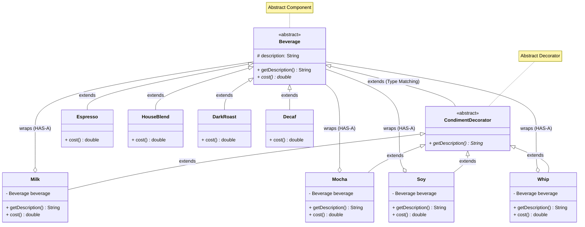

<!-- markdownlint-disable MD013-->

# The Decorator pattern

## The problem

Starbuzz coffee: is a famous brand growing too quickly it's hard to update their ordering systems to match the beverage they're selling.

The current system has these classes


Beside drinks there are also condiments and toppings, and they charge a little for each of these so the system quickly grew into class madness such as

```java
class EspressoWithSteammedMilkMocha extends Beverage {
  int cost() {}
}

class DecafWithSoy extends Beverage {
  int cost() {}
}

```

## The first approach

The first idea is to make use of instance variables and inheritance

```java
abstract class Beverage {
  int cost();
  bool hasMilk();
  bool hasSoy();
  bool hasMocha();
  // and more
}

```

This reduced a lot of complexity but still present potential problem down the line

- Price changes for toppings and condiments will force code alteration.
- New condiments will result in new methods and implementations.
- There will be inapplicable condiments to beverage (like putting whipped cream into tea)
- What if someone wants double mocha?

### The open-closed principle

> Classes should be open for extension but closed for modification

While it may seem like a contradiction, there are techniques for allowing code to be extended without direct modification.

Be careful when choosing the areas of code that need to be extended; applying the Open-Closed Principle EVERYWHERE is wasteful, unnecessary, and can lead to complex, hard to understand code.

### meet the decorator pattern

We'll start with a beverage and decorate it with the condiments at runtime

- take a dark roast coffee object
- decorate it with `mocha` object
- decorate it with `whippedcream` object
- call `cost()` and get the total cost

Step:

- let's take a `darkroast` object
- customer wants mocha so we create a mocha object and wrap it around dark roast object. We say the mocha is the decorator and its type mirrors the object it is decorating, which is a `beverage`.
- do the same for `whippedcream` object
- when need to compute the cost, we do this by calling `cost()` on the outermost decorator, which is `whippedcream` and `whippedcream` is gonna delegate computing the cost to the objects it decorates then add the cost of the `whippedcream`

> DEFINITION: The Decorator Pattern attaches additional responsibilities to an object dynamically, providing a flexible alternative to subclassing for extending functionality

Here's a few notes:

- the decorators pattern apply the open-closed principle
- Decorator must have same super type as the objects they decorate
- You can wrap object with any number of decorators at runtime

### Implementation



This looks very complex, because it is . Structurally, the pattern consists of 4 main players

- `Component``: abstract class or interface for objects that can have responsibilities added to them (`Beverage`)
- `ConcreteComponent`: Original object that you want to add behavior to (`Expresso`, `DarkRoast`,...)
- Decorator: Abstract class that implements the component interface and hold reference to a component object (`CondimentDecorator`)
- `ConcreteDecorator`: Classes that add specific state or behavior to the component (`Mocha` or `Whip`)

How this work from a programming perspective:

- You create `ConcereteCompoent` object, for example, when user order an `Expresso`
- User wants to add Milk, you wrap the `ConcreteComponent` object within the decorator (and keep doing this for user's request)
- You execute the logic needed, now extended with extra logic from decorators

```java
const drink = new Expresso();
const drinkWithMilk = new Milk(drink);
const drinkWithMilkAndMocha = new Mocha(drinkWithMilk)
// caculate cost
drinkWithMilkAndMocha.cost();
```
