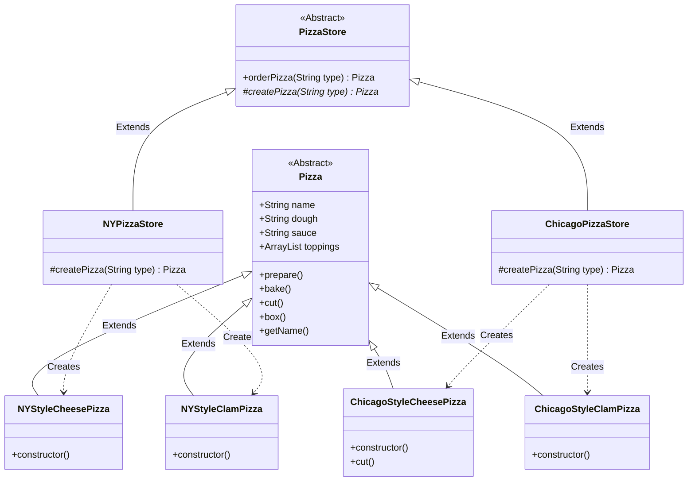

<!-- markdownlint-disable MD013-->

# The Factory Method Pattern

We've been learning about good OO - and 1 of the things that's mentioned the most is 'program interface, not implementation'.

The issue with Java (and other programming language) is that the only way to create new object is through the constructor method. It's not particularly wrong per se; it's just kind of violating the rule above

> When you use the **new** operator you are certainly instantiating a concerete class which is an implementation and not an interface

Example:

```java
Pizza pizza;

if (isNewYork) {
  pizza = new NewYorkPizza();
} else if (isItaly) {
  pizza = new ItalianPizza();
} else {
  pizza = new InstantPizza(); // ew
}
```

As our design should be open for extension but closed for modification, code snippets such as above should not exist, as they require modification as soon as `NewYorkPizza` or `ItalianPizza` classes change;

Let's apply the same steps~ by identify the aspects that vary and separate them from what stays the same.

## Encapsulating object creation

And move it into another object that is only going to be concerned with creating pizzas. This object is a `Factory` object.

Factories handle the detail of object creation. Once we have a `PizzaFactory`, other place in the codebase can ask the factory to make 1 for them.

```java
class SimplePizzaFactory {
  public Pizza createPizza(String type) {
    Pizza pizza = null;

    if (type.equals("cheese")) {
      pizza = new CheesePizza();
    } else if() {
      // more here
    }
    return pizza;
  }
}
```

While this may look pointless (as we just moved the constructor call from 1 place to another place) but we can actually override the `createPizza` method and change the pizza type being created, while maintaining the overall interface.

This will helps alot when you want to franchise your pizza since we can delegate the pizza creation to each individual store.

Another thing nice about this pattern is that its allow for composition which means runtime change during behavior without having to make changes to code.



## Meet the Factory pattern

Factory method patterns encapsulates object creation by letting subclasses decide what object to create. It defines an interface for creating an object, but lets subclasses decide which class to instantiate.

The structure consist of:

- Creator: abstract class the define factory method that subclasses implement to produce product
- Product: declares the interface, which is common to all objects that can be produced by the creator and its subclasses.
- Concrete Creator: override the base factory method to return the object. The object can be created or retreived from existing cache, object pool or another source.
- Concrete Product: implementation of product interface

You can see the example [here](./examples/factoryPattern.java)
