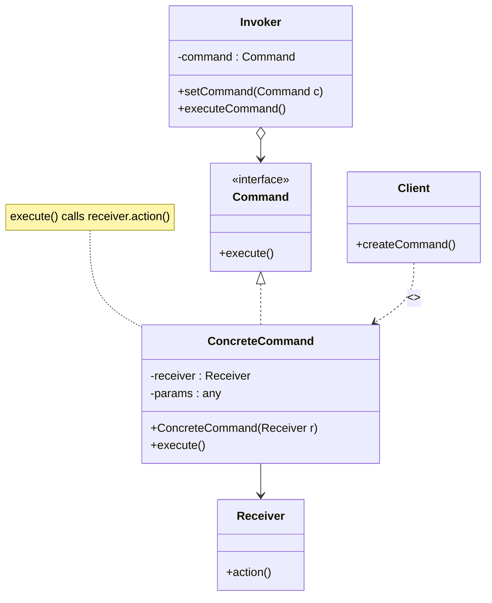
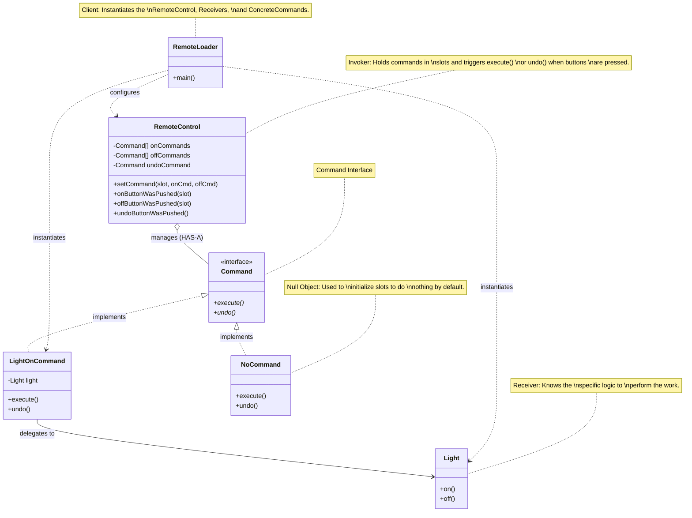

<!-- markdownlint-disable MD013-->

# Command pattern

## The problem

We're given a remote control with programmable slots and asked to design an API for programming the remote so that each slot can be assigned to control a device or set of devices. The devices ranges from Ceiling lights to Garage door to Security control,... The methods allowed varies between devices, most of them has a on and off method, as well as some other specific methods, such as: TV can have `setVolume()`, `setChannel()`, a fan can have `high()`, `low()` (speed)

- We have a bunch of classes with variety of methods, and we have to be prepared for future classes with just as diverse methods.
- The remote should know how to interpret button presses and make requests but it shouldn't know about the specific of each vendor classes.

## A little analogy

- Following the OO design principle, we need to make sure we decouple the requester of an action (the remote) from the object that actually perform the action (the fan, the TV,...) which will allow extension in the future

Let's reimagine with a diner analogy:

- The remote is us, the customer, the requester
- The devices are the chef, the cook..
- We can't make each customer manually go in and order each of their meal right? Who would want to go into the kitchen and request?
- This is where we will hire a waiter, who will take the order slip and deliver it to the chef.

The process is straight foward:

- `Customer` will `createOrder()`, resulting in an object with the order slip and the customer menu items.
- `Waiter` will `takeOrder()`, calls `orderUp()` to begin the order preparation.
- `Chef` will `makeBurger()` and `makeMilkShake()` and leave it for the waiter to pick up and serve to the customer's table

This will decouple the customer and the process of telling the chef which food to cook. They only need to create and order object. The order object is seen as a command, remaining in the order board until the chef is ready to serve it. It will contains relevant information required to cook the meal

## Meet the Command pattern

> The Command Pattern encapsulates a request as an object, thereby letting you parameterize other objects with different requests, queue or log requests, and support undoable operations.

Structurally, we can construct the command pattern through a few classes/interfaces

- `Invoker` is responsible to create command object. This must have a field for storing a reference to a command object and will trigger the command
- `Command` interface declares just a single method `execute()` for executing the command
- `ConcreteCommand` is a class that implement the command interface. It will pass the call to 1 of the business logic objects. Parameters to execute a method on the receiving object can be declared as fields in the concrete command object. We can make this object immutable
- The `Receiver` class contains some business logic. Almost any object may act as a receiver. It just a object that execute business logic. We can make the receiver the same as concrete command to simplify the code
- `Client` creates and configure concrete command object, and send it to the invoker

Let's do a mapping to our diner example:

- `Invoker` is the waiter
- `Command`/`ConcreteCommand` is the order
- `Client` is the customer
- `Receiver` is the chef

### The solution to our remote control problem

Or you can see the code example [examples/commandPattern.java](./examples/commandPattern.java)

As you can see we have the undo method in the command interface as well, with which we can revert the changes we made through the last (few) command(s) by implementing receiver objects with state and/or a history stacks.
