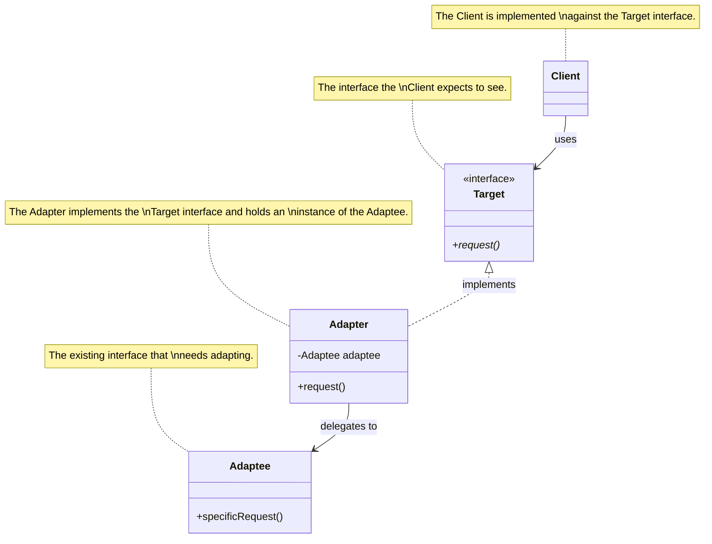
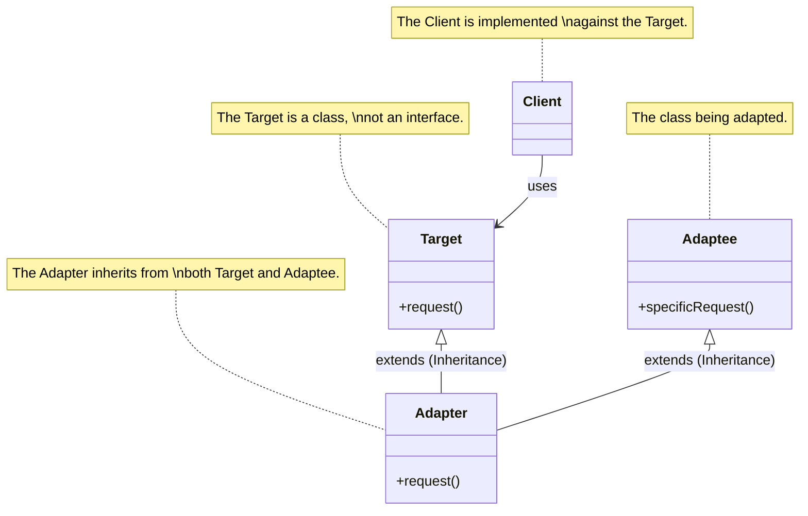

<!-- markdownlint-disable MD013-->

# The Adapter and Facade Patterns

We all know what kind of adapters we have in real life: power adapters, cable adapters, USB adapter,... In short, those adapters sit between the interface of one end and make it pluggable, compatible to another end. They can be very simple, like changing the shape of the plug so that it matches the outlet, or complex like changing the power level so that they match.

The idea of a OO adapter is the same: when a vendor class doesn't share the same interface as your current existing system, if you want to plug that vendor class in, you'll need a adapter class to stand between the 2. With this, you can:

- Avoid modifying you old code
- Create as many adapter needed for as many vendors as you need

## Adapter pattern defined

> The Adapter Pattern converts the interface of a class into another interface the client expect. Adapter lets classes work together that couldn't otherwise because of incompatible interfaces.

Since the idea and example of this pattern is pretty clear-cut let's go into details

## Object and class adapters

2 kind of adapter:

- object
- class

The 1 we draw above is an object adapter, which means they make use of composition to adapt the client request to the adaptee's object they hold. The class version will not use composition, but will inherit the Adaptee's class while also inherit the target class, making it a multi-inheritance situation

## Comparison

| feature      | object adapter                | class adapter                    |
| ------------ | ----------------------------- | -------------------------------- |
| relationship | has-a                         | is-a                             |
| behaviour    | only adds/translate behaviour | can override adaptee's behaviour |
| Object count | two objects                   | 1 object                         |
