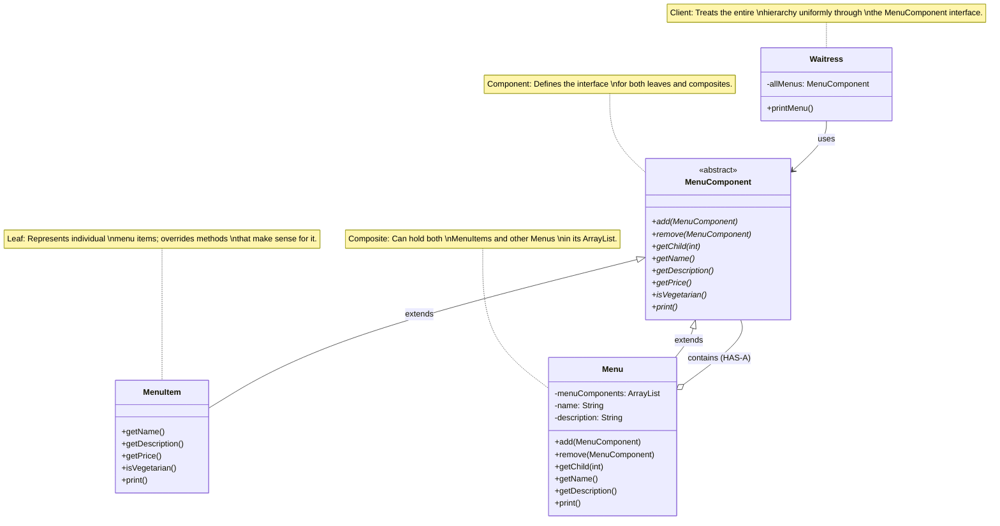

<!-- markdownlint-disable MD013-->

# The Composite pattern

## The problem

After the Diner and the Pancake house merged using the iterator pattern, the Waitress has been implemented nicely, now the Cafe wants to join as well. It also has a menu and it doesn't look like too much trouble to integrate into our current system.

The Cafe is using a Hash table for their menu collection and supporting iterator with a hash table is easy, it's not quite the same as an array list, but it's easy.

Now, imagine a situation where more and more store want to join, and the waitress has to manage more of them? In that case, something as simple as defining class attributes for each store will not be a good solution anymore.

```java
MenuList dinerMenu;
MenuList pancakeHouseMenu;
MenuList cafeMenu;
MenuList pizzaPlaceMenu;
// more and more
```

The waitress has to manage the menu lists better. Our first instinct is to use a collection of menu list with, for example, a name for identifying which menu is which

```java
// MenuList: {name, collection}
ArrayList<MenuList> menuLists
```

Another problem: what if, within the cafe menu, they want to include another menu for dessert?

```json
{
  "name": "cafe menu",
  "items": ["stuff"],
  "subMenu": {
    "name": "dessert",
    "items": ["stuff"]
  }
}
```

Now, the menu become something more like a tree, with level of sub menus which we need to take into account for when designing our objects.

## The composite pattern

While still implementing the iterator, we also would want another pattern to solve the problem.

> The composite pattern allows you to compose objects into tree structures to represent part-whole hierarchies. Composite lets clients treat individual objects and compositions of objects uniformly.



The composite pattern allows us to build structures of objects in the form of trees that contain both compositions of objects and individual objects as nodes. We can apply the same operations over both composites and individual objects, helping use ignore the differences between compositions of objects and individual objects most of the time.

The steps to implement a composite pattern:

- Define the component interface or abstract class (it's `MenuComponent` in the diagram)
- Provide the default implementation: since some methods only make sense for composites and other only make sense for leaves, the abstract class should have a default implementation for all methods.
- Implement the leaves class. These classes represent individual in the composition that has no children (e.g `MenuItem`)
- Implement the composite class: nodes that hold the children (e.g `Menu`)
- Use a collection to store children like `ArrayList` or `HashMap`
- Override the child management methods in the composite
- Implement recursive operations in the composite (e.g `print()`)
- Program the client to the component interface
