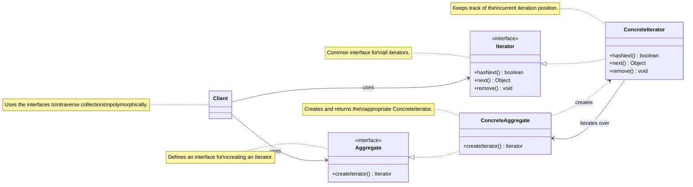

<!-- markdownlint-disable MD013-->

# The iterator pattern

## The problem

Let's say we have Pancake house and Diner is having a merge. The issue arise when they have different implementation of storing menu.

The Diner is using raw array (`MenuItem[]`) whereas Pancake house is using an `ArrayList<MenuItem>`. This could be problematic when there's a client that uses the 2 menus. Let's say a client or a Waitress newly hired to help with this joint operation and her job would be:

- `printMenu()`
- `printBreakfast()`
- `printLunchMenu()`
- `printVegetarianMenu()`

For example, if we were to implement the first method `printMenu()` with the joint menus from Diner and Pancake House, it's proven to be problematic since we'd have to separately get each menu and use 2 loops to iterate through them items. If another restaurant decides to join as well, we'd need to update our code and add another loop.

That is the problem. Both Pancake House and Diner don't want to change their implementation (or maybe they can't) so it means it is upon us to implement and maintain the code for the Waitress.

## The solution

We encapsulate the iteration. Instead of worrying on the detail of the loop (Do I use .size() or .length? Do the index start with 1 or 0?) We define a same interface to iterate through a collection

```java
Iterator iterator = breakfastMenu.createIterator();

while(iterator.hasNext()) {
  MenuItem item = (MenuItem) iterator.next();
}
```

Now the only thing we need to do is for the Diner and Pancake to create implementation of this interface.

## The iterator pattern defined

> provides a way to access the elements of an aggregate object sequentially without exposing its underlying representation.

The iterator pattern relies on an interface (and its implementation) called an iterator



Component:

- Iterator interface declares the operations required for traversing the collection: fetching next element, retrieving current position, restarting iteration, ...
- Concrete iterators implement specific algorithms for traversing. This is where we do different implementation based on our underlying collection
- Collection interface: declare 1 or multiple methods for getting iterators compatible with the collection. For example: `IterableCollection` with a `getIterator()`method that returns an`Iterator` object
- Concrete Collection return new instances of particular concrete iterator class each time the client requests one.
- The client use both the collection and their iterator via these interfaces

The Menu example above is rewritten into [./examples/iteratorPattern.java](./examples/iteratorPattern.java)
